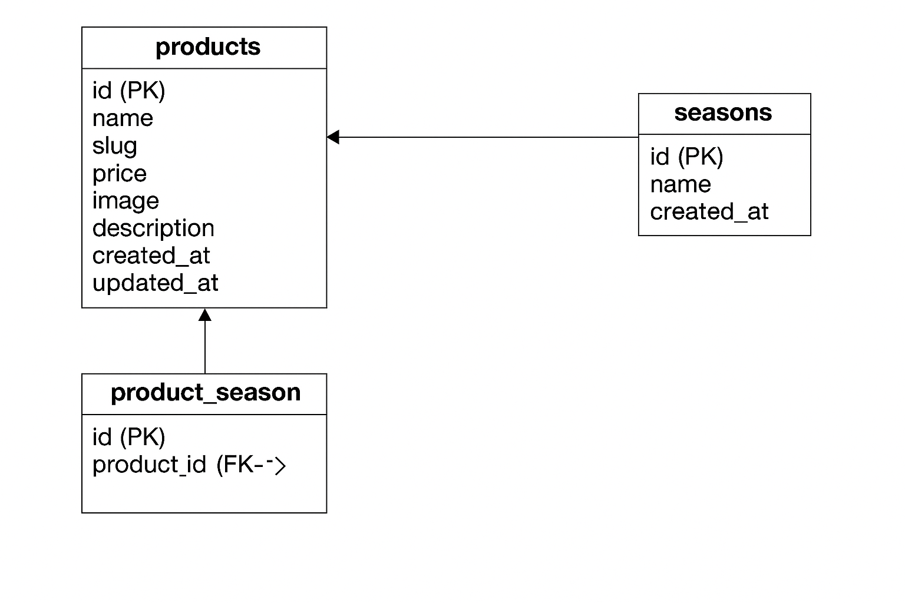

# Contact Test 2

## 📖 概要

このアプリケーションは、LaravelとDocker環境で構築した商品管理システムです。  
ユーザーはログイン機能（Fortify）を使用してログインし、  
商品一覧の確認・登録・バリデーション機能を通じて商品を管理することができます。
---

## 🌐 開発環境 URL

-   http://localhost

---

## 🛠 使用技術

-   PHP 8.x
-   Laravel 8.x
-   MySQL 8.x
-   Docker / docker-compose

---

## ✨ 機能一覧

-   ログイン・ログアウト機能（Fortify）
-   新規登録機能
-   管理者による一覧・検索・削除機能
-   ページネーション・バリデーション機能

---

## ⚙️ 環境構築手順

```bash
git clone https://github.com/mikihope/contact-test2.git
cd contact-test2
docker-compose up -d --build
docker-compose exec php bash
composer install
cp .env.example .env
php artisan key:generate
php artisan migrate --seed

## 🧩 ER図

<!-- 通常のMarkdown画像 -->


<!-- フォールバック（VSCodeのプレビューや一部レンダラ対策） -->


<!-- さらに念のため、GitHubで直接開けるリンクも置く -->
🔗 画像が表示されない場合は [ER.png を直接開く](https://raw.githubusercontent.com/mikihope/contact-test2/main/ER.png)


## 📍 動作確認URL一覧

| ページ名 | URL | 内容 |
|-----------|------|------|
| トップページ | http://localhost | Laravel起動確認 |
| 商品一覧 | http://localhost/products | 商品の一覧を表示 |
| 商品登録 | http://localhost/products/create | 新しい商品を登録 |
| バリデーション確認 | http://localhost/products/create | 入力を空のまま送信して確認 |
| ログインページ（Fortify） | http://localhost/login | 認証機能の確認（必要に応じて） |


